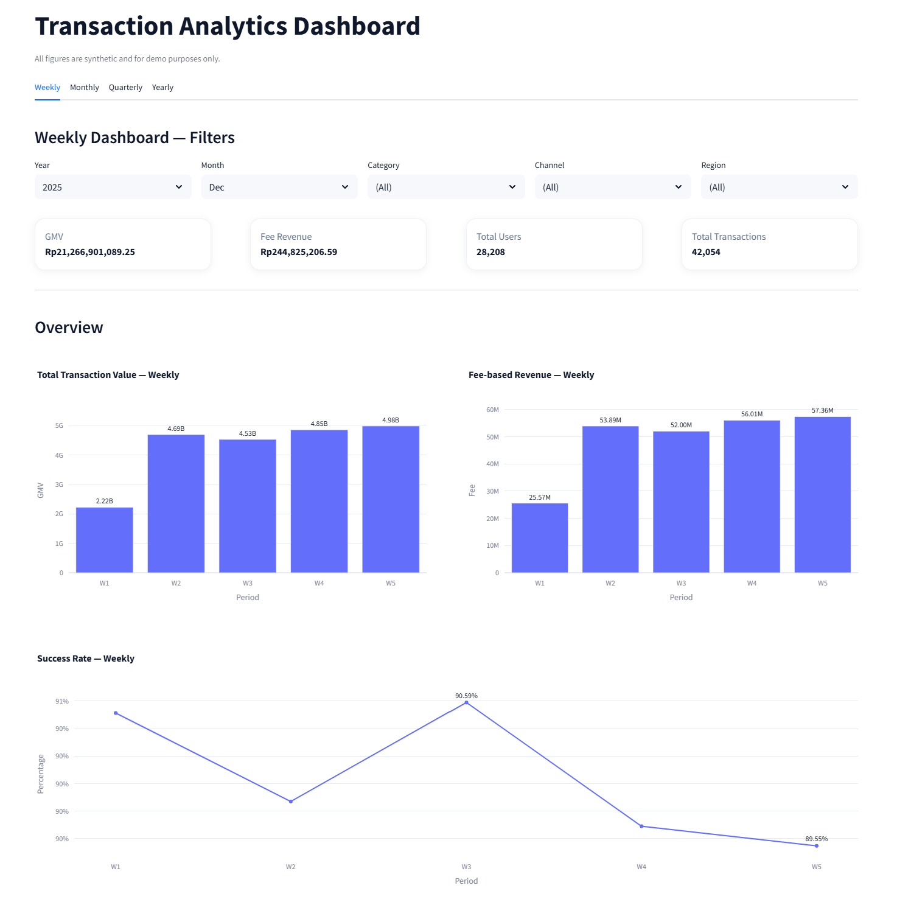
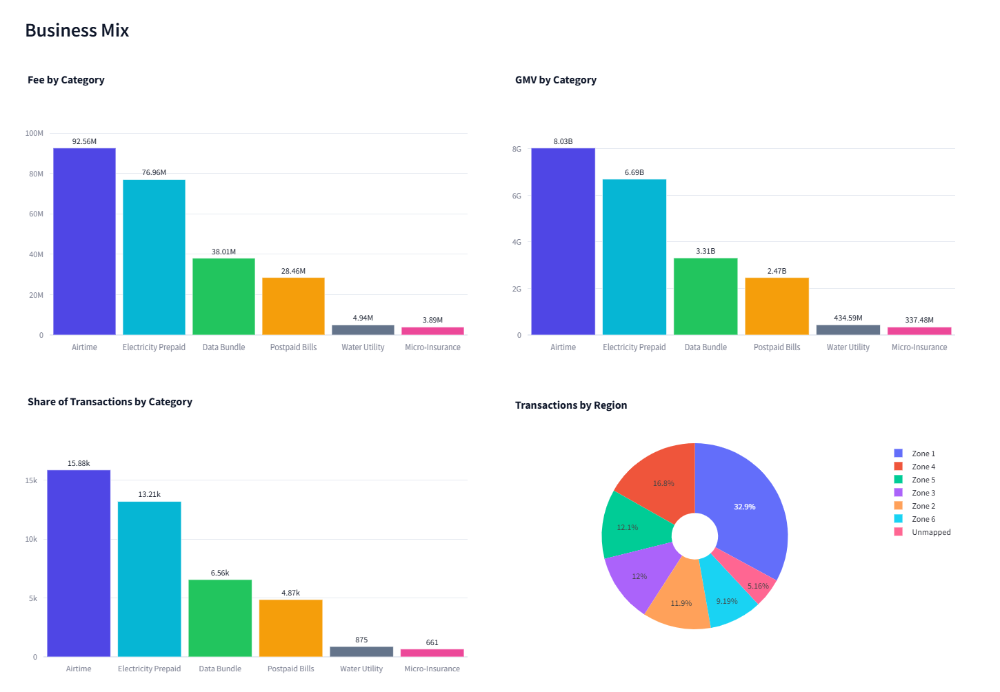
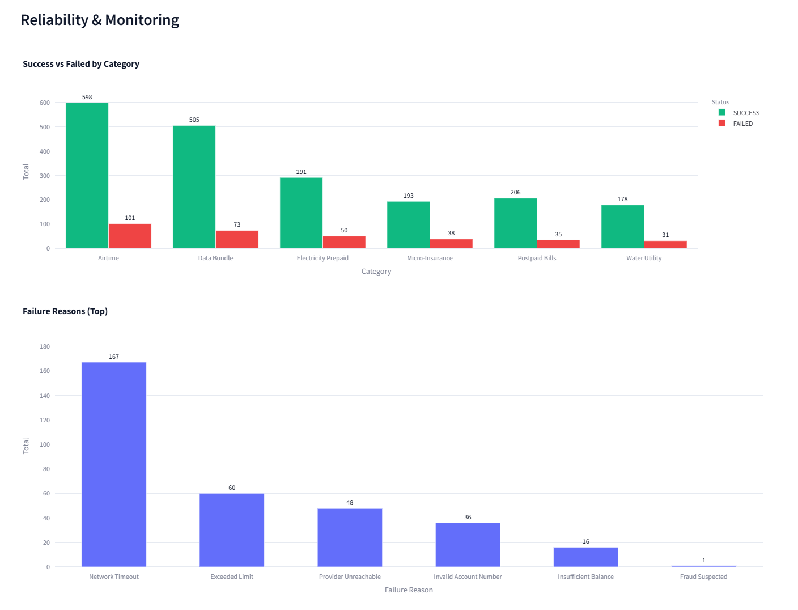
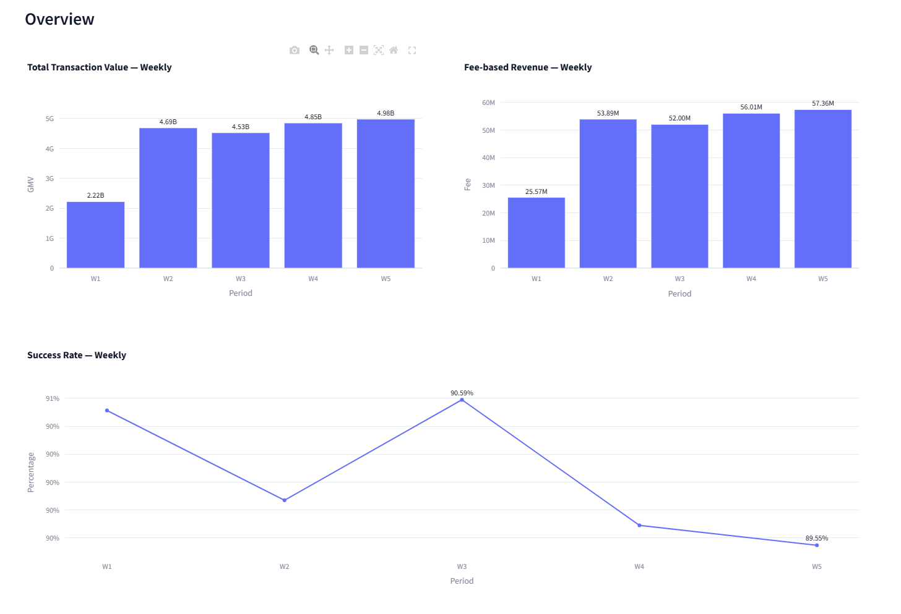
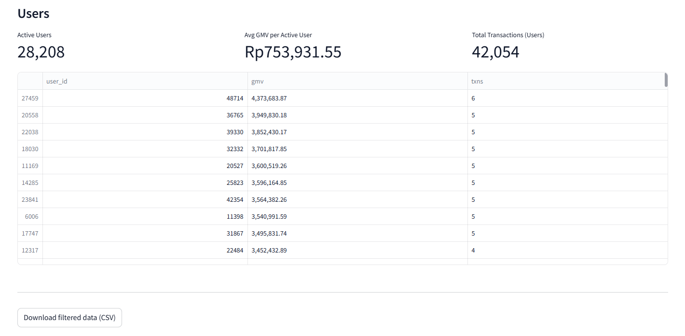

# 📊 Transaction Analytics Dashboard

[](https://github.com/ilfijandrisno/Transaction-Analytics-Dashboard/releases) [](https://www.python.org/) [](https://streamlit.io/) [](https://plotly.com/python/)    

  


## 📌 Deskripsi
**Transaction Analytics Dashboard** adalah aplikasi interaktif berbasis **[Streamlit](https://streamlit.io/)** yang dirancang untuk memantau dan menganalisis data transaksi dari berbagai kategori produk/layanan, channel distribusi, dan wilayah pemasaran.

Dashboard ini membantu **tim bisnis, manajemen, dan operasional** untuk:
- Memantau **nilai transaksi** (Total Transaction Value)
- Melihat **Fee-Based Revenue**
- Mengukur **Success Rate** transaksi
- Menganalisis **distribusi bisnis** berdasarkan kategori, channel, dan region
- Memantau **reliabilitas dan kinerja** per periode

Dataset yang digunakan adalah **dummy data** yang disimulasikan untuk 3 tahun terakhir..

---

## 📂 Struktur Dashboard

### 1️⃣ **Weekly Dashboard**
- Menampilkan KPI mingguan
- Filter: **Year**, **Month**, **Category**, **Channel**, **Region**
- Cocok untuk memantau tren mingguan secara rinci

### 2️⃣ **Monthly Dashboard**
- Analisis kinerja bulanan
- Filter: **Year**, **Category**, **Channel**, **Region**
- Memudahkan evaluasi performa tiap bulan

### 3️⃣ **Quarterly Dashboard**
- Ringkasan per kuartal
- Filter: **Year**, **Category**, **Channel**, **Region**
- Berguna untuk review bisnis per kuartal

### 4️⃣ **Yearly Dashboard**
- Gambaran besar kinerja tahunan
- Filter: **Category**, **Channel**, **Region**
- Cocok untuk laporan akhir tahun

---

## 📊 Komponen Analisis

<p align="center">
  
</p>

### 🔹 **Overview**
Menampilkan ringkasan indikator utama (KPI) berdasarkan periode terpilih:
- **Total Transaction Value** → Nilai total seluruh transaksi.
- **Fee-Based Revenue** → Total pendapatan dari biaya transaksi.
- **Success Rate** → Persentase keberhasilan transaksi.
- **GMV / Avg GMV per Active User** → Nilai transaksi rata-rata per pengguna aktif. 

---

### 🔹 **Business Mix**

<p align="center">
  
</p>

Menganalisis komposisi bisnis dari berbagai perspektif:
- **Fee by Category** → Nilai fee per kategori produk/layanan.
- **Share of Transactions by Category** → Persentase jumlah transaksi tiap kategori dibandingkan total transaksi keseluruhan (membantu mengidentifikasi kategori dominan).
- **Channel Distribution** → Distribusi transaksi berdasarkan channel (Agent, App, Web).
- **Regional Distribution** → Distribusi transaksi per wilayah (pie chart).

---

### 🔹 **Reliability & Monitoring**

<p align="center">
  
</p>

- **Success vs Failed by Category** → Membandingkan jumlah transaksi sukses dan gagal untuk tiap kategori, dengan warna **hijau** (success) dan **merah** (failed).
- **Failure Reasons (Top)** → Menampilkan daftar alasan kegagalan transaksi terbanyak.

---

### 🔹 **Users**

<p align="center">
  
</p>

- **Active Users by Channel** → Jumlah pengguna aktif dibagi berdasarkan channel distribusi.
- **Active Users by Region** → Jumlah pengguna aktif per wilayah pemasaran.

---

## 🗂 Struktur Data Dummy

| Kolom               | Deskripsi |
|---------------------|-----------|
| `date`              | Tanggal transaksi |
| `year`              | Tahun transaksi |
| `month`             | Nama bulan transaksi |
| `week`              | Nomor minggu transaksi |
| `quarter`           | Nomor kuartal (1–4) |
| `category`          | Jenis produk/layanan (Airtime, Data Bundle, dll.) |
| `channel`           | Saluran distribusi (Agent, App, Web) |
| `region`            | Wilayah pemasaran (Zone 1–6, Unmapped) |
| `transaction_value` | Nilai transaksi (dalam satuan mata uang) |
| `fee_based_revenue` | Pendapatan berbasis fee |
| `status`            | Status transaksi (Success / Failed) |

> File data default: **`data/transactions_dummy.csv`** (diletakkan di direktori data).  
> Format kolom mengikuti skema di atas.
---

## 🚀 Cara Menjalankan di Lokal

1. **Clone Repository**
   ```bash
   git clone https://github.com/ilfijandrisno/Transaction-Analytics-Dashboard.git
   cd Transaction-Analytics-Dashboard
   ```
2. **Instalasi Dependensi**
   ```python
   pip install -r requirements.txt
   ```
3. **Jalankan Aplikasi**
   ```python
   streamlit run streamlit_app.py
   ```